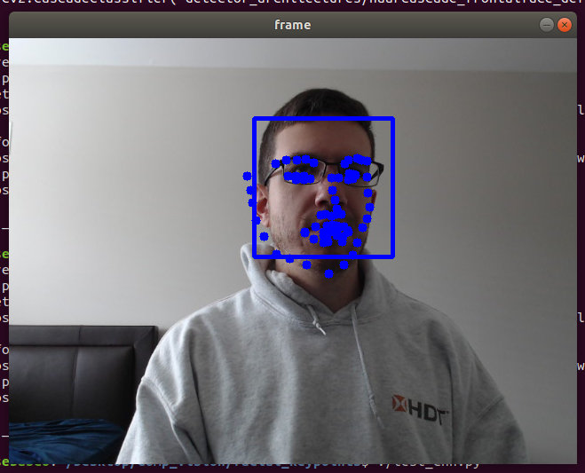
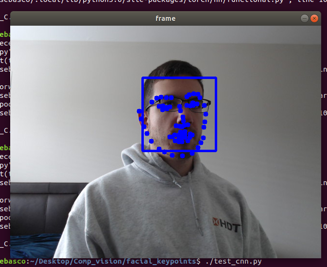
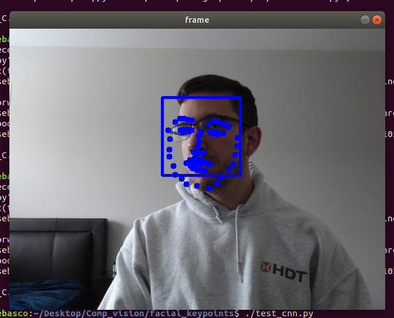

# First project for Udacity Computer Vision Nano Degree

## Facial Key Point Detection

The pbjective of this project is to build and train a CNN which takes in a face and produces a set of 68 key points defining important features in the face. Some examples include the eyes, the jaw line, points around the mouth and nose, etc. The images below show the reult of integrating the CNN with Haar cascades from OpenCV and turning on a camera stream.

## Network Architecture

The CNN used is modeled after the one found in <a href=""https://arxiv.org/pdf/1710.00977.pdf><u>this</u></a> paper. The CNN consists of 4 convolutional layers followed by three fully connected layers. The convolutional layers are sandwiched by random dropput and max pooling layers. The table above follows the network architecture from input to output (the image size input is 224x224x1.

<table style="width:100%">
  <tr>
    <th>Layer</th>
    <th>Size</th>
  </tr>
  <tr>
    <td>Conv1 (4,4)</td>
    <td>32x221x221</td>
  </tr>
  <tr>
    <td>Max Pooling (2,2)</td>
    <td>32x110x110</td>
  </tr>
  <tr>
    <td>Random Dropout (0.1)</td>
    <td>32x110x110</td>
  </tr>
  <tr>
    <td>Conv2 (3,3)</td>
    <td>64x108x108</td>
  </tr>
  <tr>
    <td>Max Pooling (2,2)</td>
    <td>32x54x54</td>
  </tr>
  <tr>
    <td>Random Dropout (0.2)</td>
    <td>32x54x54</td>
  </tr>
  <tr>
    <td>Conv3 (2,2)</td>
    <td>128x53x53</td>
  </tr>
  <tr>
    <td>Max Pooling (2,2)</td>
    <td>128x26x26</td>
  </tr>
  <tr>
    <td>Random Dropout (0.3)</td>
    <td>128x26x26</td>
  </tr>
  <tr>
    <td>Conv4 (1,1)</td>
    <td>256x26x26</td>
  </tr>
  <tr>
    <td>Max Pooling (2,2)</td>
    <td>256x13x13</td>
  </tr>
  <tr>
    <td>Random Dropout (0.4)</td>
    <td>256x13x13</td>
  </tr>  
</table> 